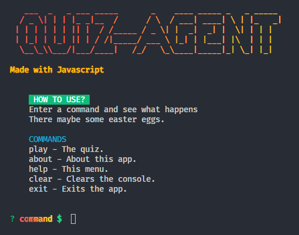

<h1 align="left">
    Quiz Agent (CLI)
</h1>

## How to use it
**Prerequisites** 
- Node (LTS, 18.0.0, etc...)
- Terminal (Powershell, bash, etc...)

**Instructions**
- Run `npx quiz-agent` in your preferred terminal.